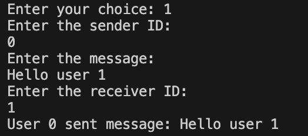
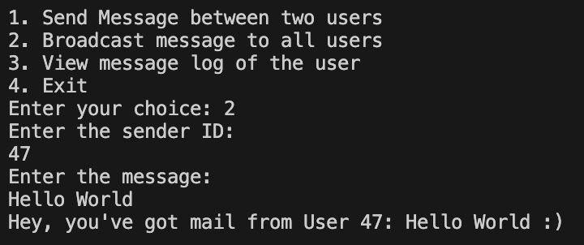
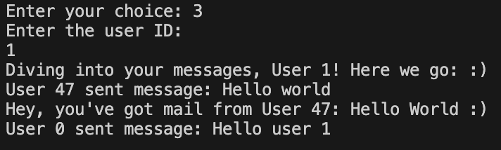
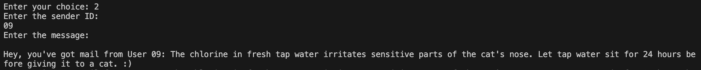

# Go Chats Messaging Application

## Overview
Go Chats is a command-line messaging application built in Go, facilitating communication among users through a central channel. Users can send messages directly to each other, broadcast messages to all users, and view their message logs. The application runs entirely in the terminal and does not require a persistent database, as all data is stored in-memory during runtime.

## Features
- **Send Message**: Allows a user to send a message directly to another user.
- **Broadcast Message**: Enables sending a message to all users currently in the system.
- **View Message Log**: Users can view their received messages anytime during the session.
- **Exit**: Allows users to exit the application.





## Files in the Repository
- **main.go**: The entry point of the application, handling user interactions and controlling the application flow.
- **messages.go**: Manages users and messages, including sending, broadcasting, and retrieving messages.
- **api.go**: Interacts with an external API to fetch random facts, providing content for empty messages.

## How Each File Contributes

### main.go
- **Purpose**: Manages the CLI user interface and the main control flow of the application.
- **Importance**: It initializes user interactions and determines the operational logic based on user input, making it the core of user experience and application management.

### messages.go
- **Purpose**: Handles the logic for message storage, sending, and logging.
- **Importance**: This file ensures that messages are processed correctly—sent, stored, and retrieved—safeguarding the functionality of the messaging features.

### api.go
- **Purpose**: Provides functionality to fetch random facts from the catfact.ninja API, used for generating messages when users send empty inputs.
- **Importance**: Enhances the application by integrating external content, demonstrating the application’s ability to utilize web APIs for dynamic content generation.



## Running the application
To run this application, ensure you have Go installed on your machine. Clone the repository
```
git clone https://github.com/syamkarni/Go_message
```
 and navigate to the project directory. Execute the following commands:

```bash
go build
./go-chats
```

Follow the on-screen prompts to interact with the application.

## Dependencies
- Go
- A stable internet connection to make a connection with catfact.ninja API
